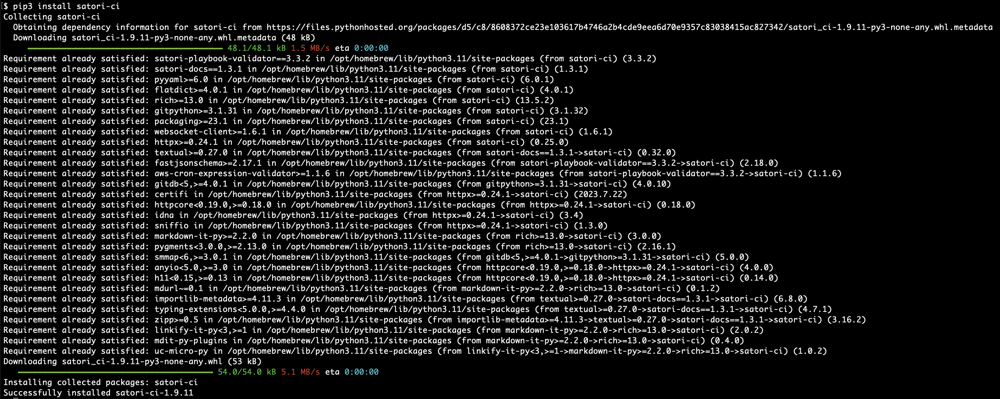
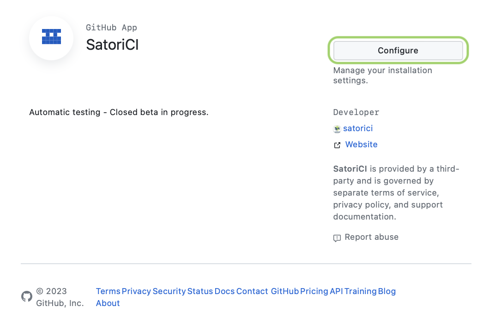
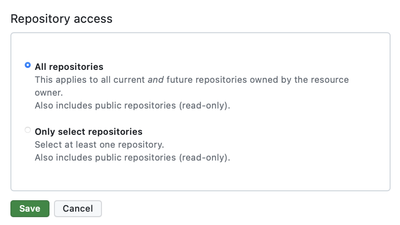

# Install

We have a CLI tool that can be installed with `pip` and a [Github Application](../modes/ci/github.md) to connect with your CI process. Additionally, we can also be launched on [Gitlab](../modes/ci/gitlab.md), with [Jenkins](../modes/ci/jenkins.md) or [Github Actions](../modes/ci/action.md). Of course, our Web interface is also a key component at https://www.satori-ci.com to better visualize your results.

## Install Satori CLI

Three steps:

1. Execute on your command line terminal:

```console
pip3 install satori-ci
```



2. With Satori CLI installed, now we need to get a Satori Token to use it:

  * Log in the Satori website using Github credentials: https://satori.ci/login
  * On the Satori website go to Settings->Teams
  * Copy your API Token

3. Replace the string YOUR_TOKEN with your clipboard on the next command:

```console
satori config token YOUR_TOKEN
```


## Install Satori CI Github App

Each time you push code to your Github repository, there's a risk that it could affect the security of your project. Furthermore, should your data ever be compromised, it's crucial to minimize the exposure of sensitive information. Two primary areas of concern are:

- Secrets on your code
- Vulnerable code from yourself or third parties

Automatically test your GitHub repositories by installing our App:

**1) Satori CI for Github** <https://github.com/apps/satorici>



Be mindful that you need to be authenticated to configure it.

**2) Click on Configure**


Select on which accounts you will be setting it up.

**3) Select the repositories where you will be installing it or select all repositories**



Once you are done, click on **Save**. We care about your security, so we will only store your email, your repositories names, and the reports. Your code only lives within the virtual machines that are present during the execution.

**4) Create your first .satori.yml file**

Within the repositories that you will connect, you want to create a file named `.satori.yml`. This file will contain the tests that you will executing on every push. Let's keep it simple, and start checking for secrets with Trufflehog:

```yml
settings:
  name: CI Tests for every push of my Repo

import:
- "satori://code/trufflehog.yml"

tests:
  assertReturnCode: 0
  build:
  - [ make ]
  run:
    assertStdoutContains: "An expected output" # assert the output of    the main system execution of your project
    your_project:
    - [ ./your_project ]
```

These are the steps to run it locally:

```sh
git clone git@github.com:satoridev01/Hello_C_World.git
cd Hello_C_World
satori run ./ --output
```
---

If you need any help, please reach out to us on [Discord](https://discord.gg/F6Uzz7fc2s) or via [Email](mailto:support@satori-ci.com)

