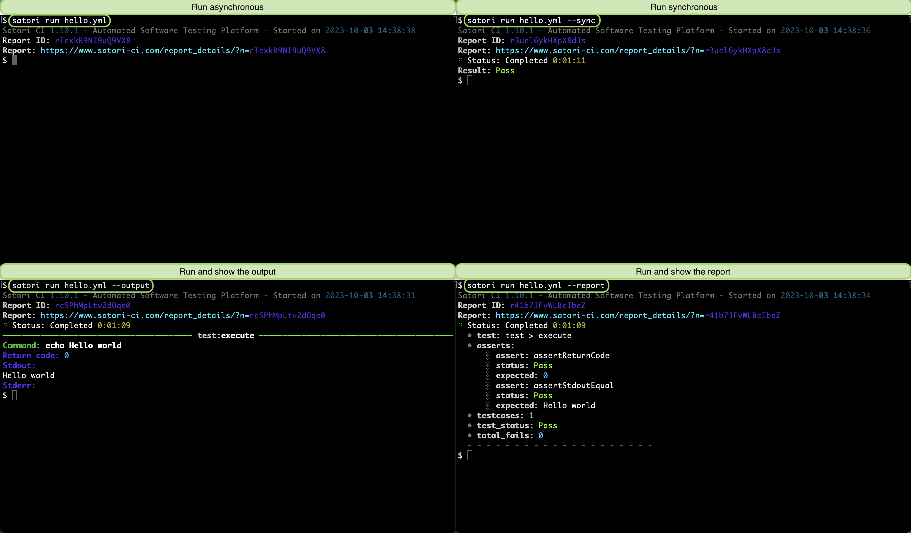
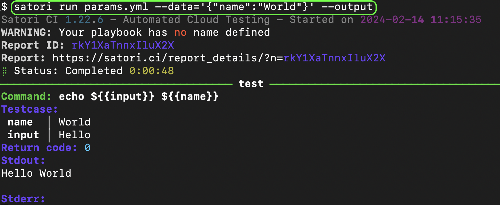
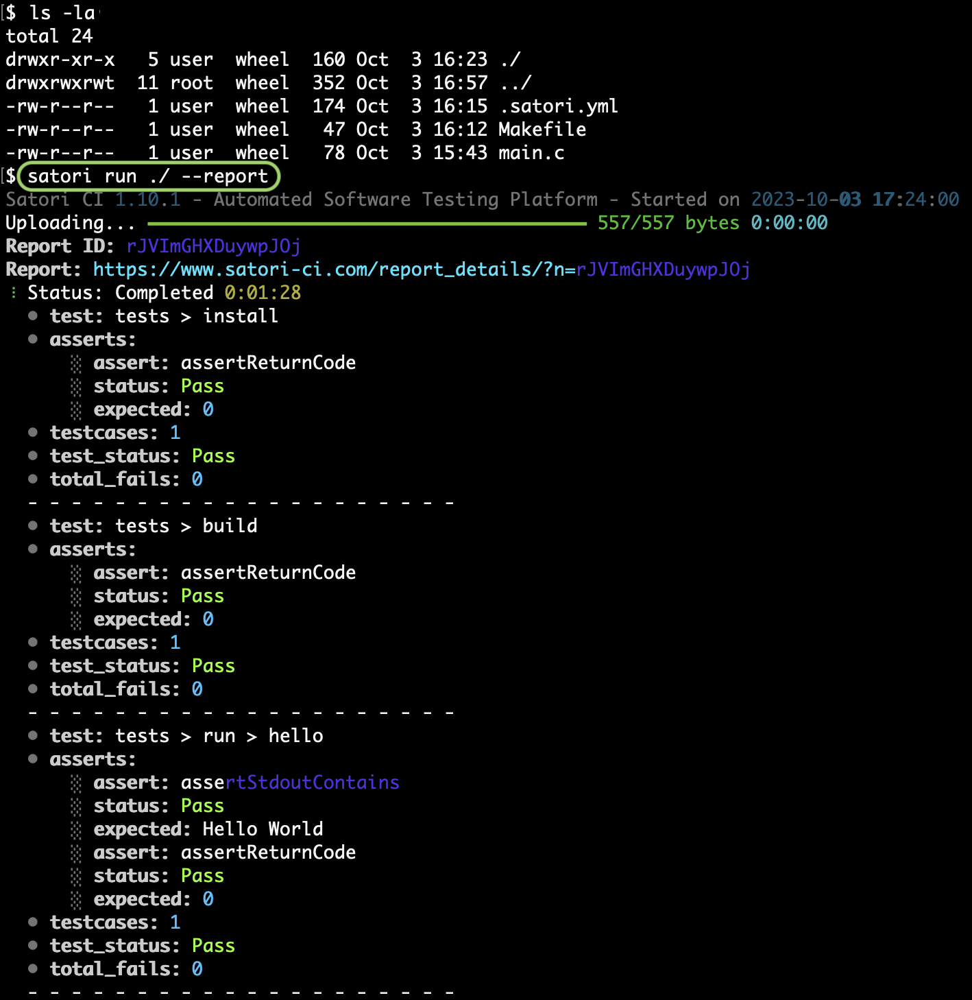
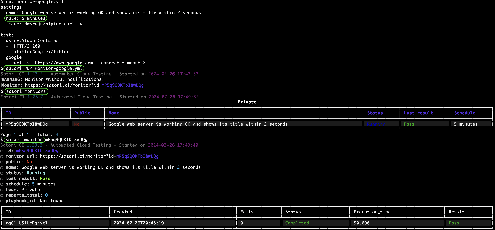

# Run

Satori CLI runs playbooks on demand. Here are some use cases:

### Run a Local Playbook

This playbook named `hello.yml`:

```yml
test:
  assertStdoutEqual: "Hello world\n"
  assertReturnCode: 0

  execute:
    - [ echo Hello world]
```

Can be run:
- With no parameters: asynchronously
- With `--sync`: synchronously and it shows the status when is complete
- With `--report`: synchronously and it shows the report when is complete
- With `--output`: synchronously and it shows the output when is complete



## Run a Playbook with Parameters

If you define $(variables) within your playbook that are not satisfied, they will be considered parameters expected when being called. Consider this playbook named `params.yml` that will echo "Hello" along with the name provided as a parameter:

```yml
input:
- "Hello"
test:
- [ echo $(input) $(name) ]
```



### Run with the files in the Local Directory
In case you are working locally on a directory with source code, you save your playbook as `.satori.yml` within the directory, just as you would for your repo when testing your code through CI. 

Consider the following example main.c file, that is referenced by a Makefile, and a playbook that verifies that everything returns the code 0 and when running the code it outputs "Hello World":

- **main.c**:

```c
#include <stdio.h>

int main() {
    printf("Hello World\n");
    return 0;
}
```

- **Makefile**:

```c
all: hello

hello: main.c
	gcc -o hello main.c
```

- **.satori.yml**:
```yml
tests:
  assertReturnCode: 0
  install:
  - [ apt install -qq -y make gcc ]
  build:
  - [ make ]
  run:
    assertStdoutContains: "Hello World"
    hello:
    - [ ./hello ]
```



You would use it like this when developing locally before pushing, or when being used as part of Github Actions or Jenkins. 

### Run a Public Playbook
You can run on demand public playbooks. You can see a list of the publicly available playbooks with: `satori playbook --public`

And then you can execute them passing parameters if required with --data:

```sh
satori run satori://some/playbook.yml
```


You would run it like this when there is a public playbook that already addresses your problem.

### Run a Monitor

When adding the rate or schedule setting, you will be running a playbook with a certain frequency. This playbook named `monitor_google.yml` will check that Google is working as expected once per day:

```
settings:
  name: Google web server is working OK and shows its title within 2 seconds
  rate: 5 minutes

test:
  assertStdoutContains:
  - HTTP/2 200
  - <title>Google</title>
  google:
  - [ curl -si https://www.google.com --connect-timeout 2 ] 
```



[Learn more about Monitors](monitor.md)

