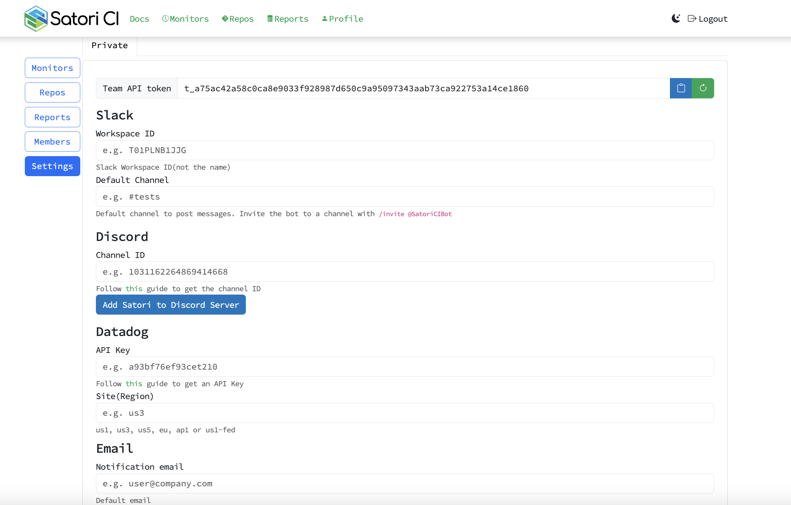

# Notifications

## Settings:
You can set the notifications via the web interface or using the CLI.

### CLI:

View settings:
You can view your current settings by executing the following command.
```sh
satori team Private settings
```


Email setting:
```sh
satori team Private set_config notification_email your@email.com
```


The definition of where you will be notified starts on your playbook settings. In there, depending if you want to be notified every time (`log`), on every fail (`logOnFail`) or every time it passes (`logOnPass`) you will define if you want to be notified via email, via a Github Issue on your repo, via slack or via discord.

By default, you will get notified with emails unless you change your playbook settings.

## Playbook Settings

```yml
settings:
  log|logOnFail|logOnPass: email|issue|slack|discord|datadog

[...]
```

So, a common thing is to get notified on slack when something fails, and you would do it like this:

```yml
settings:
  logOnFail: slack

[...]
```

## Slack and Discord

Now, we already know your email and where to write issues for your repositories, but we will need some help with your Slack and/or Discord server on your [dashboard settings](https://www.satori.ci/dashboard/)



### Slack

To obtain the workspace ID and channel ID for a Slack Channel, follow these steps:

**Channel and Workspace ID**:

1. Go to the web version of Slack and to the channel that you're interested in.
2. In your web browser's URL bar, you will see a URL that looks like this: https://app.slack.com/client/T00000000/C00000000. The part after '/client/' is split into two segments by a slash. 
3. Put the first segment (e.g., 'T00000000') as the workspace ID, and 
4. The second segment (e.g., 'C00000000') as the channel ID.
5. Invite the bot to a channel with /invite @SatoriCIBot

### Discord

To get the Channel ID in Discord, you first need to enable Developer Mode. Here's how you can do it:

**Enabling Developer Mode**:

1. Open your Discord settings. You can do this by clicking the gear icon located in the bottom left, next to your username and avatar.
2. In the settings menu, select 'Appearance' under the 'App Settings' category.
3. Scroll down until you find the 'Advanced' section, and there you'll find a switch labeled 'Developer Mode'. Make sure it's toggled on.

Once you've enabled Developer Mode, you can get your Channel ID as follows:

**Channel ID**:

1. Right-click the channel name.
2. Select 'Copy ID' from the dropdown menu. The channel ID is now copied to your clipboard.

 Remember, you can use this method to get IDs for text channels, voice channels, categories, and even individual messages.

If you need any help, please reach out to us on [Discord](https://discord.gg/F6Uzz7fc2s) or via [Email](mailto:support@satori-ci.com)

## Datadog

Satori CI supports Datadog Events as notification system. To use it you need an **API Key** and the **Site Region** from Datadog.

1. To create an API Key for Satori you can go to **Organization Settings** -> **API Keys** -> **+New Key**

2. Configure the new key with Satori CLI:

```shell
satori team {MySatoriTeam} set_config datadog_api_key {MyDatadogApiKey}
```

Replace **{MySatoriTeam}** with your Satori team name and **{MyDatadogApiKey}** with your Datadog API key

3. Optional. By default the events are sent to the `us1` site region, you can configure another site region with:

```shell
satori team {MySatoriTeam} set_config datadog_site {MyDatadogRegion}
```

Replace **{MyDatadogRegion}** with `us1`, `us3`, `us5`, `eu`, `ap1` or `us1-fed`

4. Now you can enable Satori Datadog notifications on your playbooks with:

```yml
settings:
  logOnFail: datadog
```

## Notifications with PDF Report

If you want to receive a copy of your report in PDF along with your notification, you can do so indicating it as part of your playbook settings:

```yml
settings:
  onLogFail: slack
  report: pdf
```
