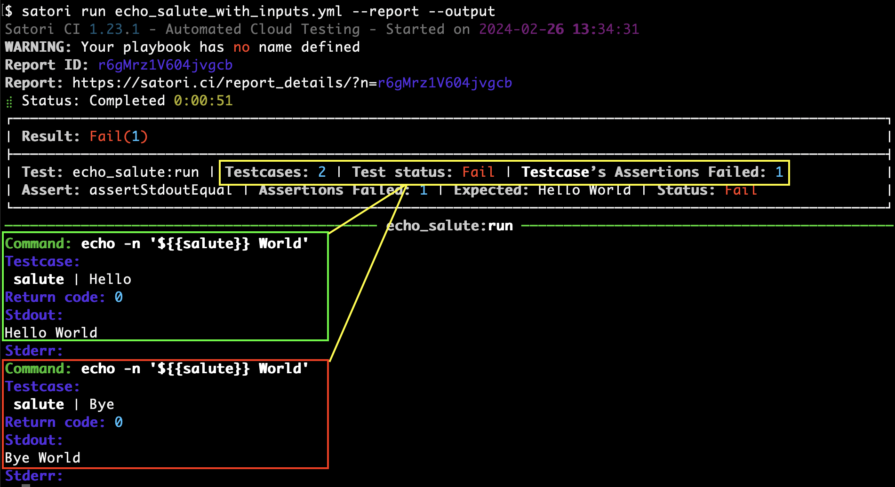

# Executions

The execution happens whenever your test contains an element. For example:

```yml
echo_stdout:
- echo 'Hello World'
```

Whenever you want your commands to execute under a shell, we will either detect that automatically or you can enforce it by putting the commands between quotes:

```yml
echo_file:
- "echo 'Hello World' > file"
```

## Inputs on executions

It should be noted that [inputs](inputs.md) can be defined to be used as part of the executions:
```yml
salute:
- - "Hello"
  - "Bye"

echo_salute:
  assertStdoutEqual: "Hello World"
  run:
  - echo '${{salute}} World'
```



The previous example will assert that the output will be Hello World, and it will show one Pass and one Fail due to the possible combinations. For more information on the assert please visit the [asserts](asserts.md) section. 

If you need any help, please reach out to us on [Discord](https://discord.gg/F6Uzz7fc2s) or via [Email](mailto:support@satori-ci.com)
