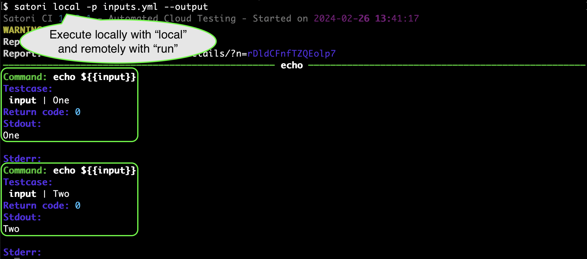
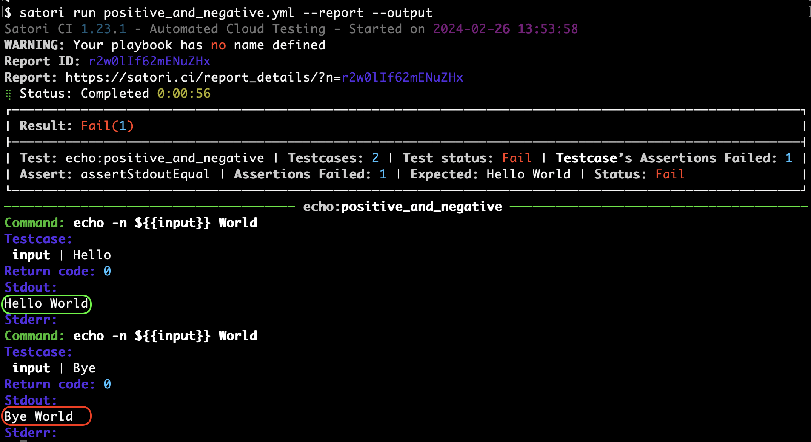
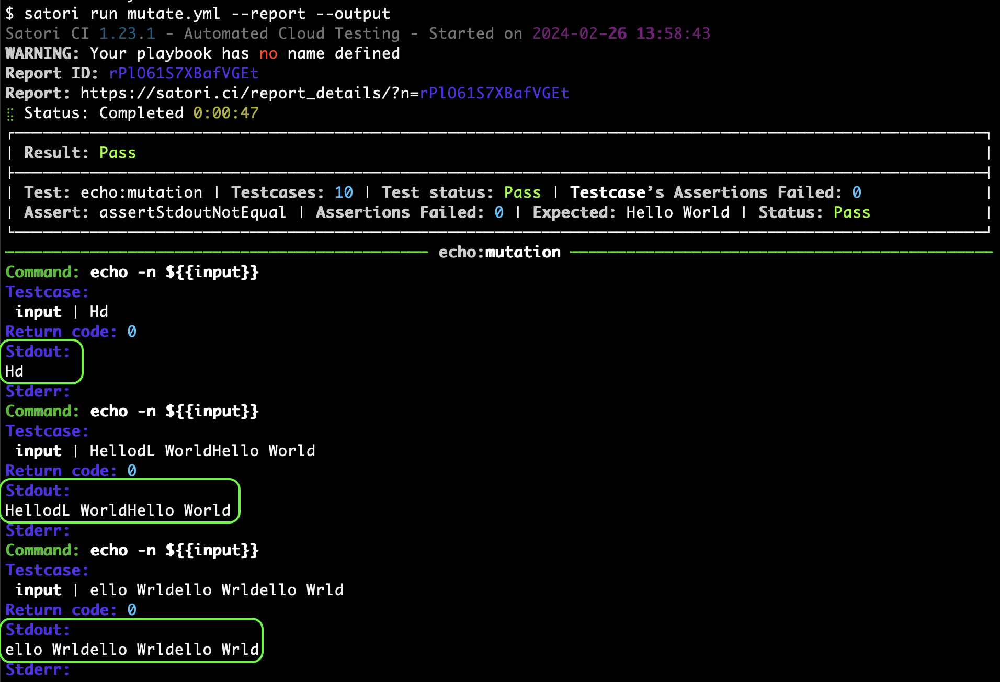

# Inputs

Inputs can be grouped under any non reserved word (settings, assert*)

```yml
input:
- - "One"
  - "Two"

echo:
- echo ${{input}}
```

For example:



You can also define different nested values. The following example will show a Pass for the positive test, and a Fail for the negative test:

```yml
input:
  positive:
  - - "Hello"
  negative:
  - - "Bye"

echo:
  assertStdoutEqual: "Hello World"
  input:
  - echo -n $(input) World
```

For example:



## Dictionaries

Dictionary files can be splitted by certain characters (normally newlines) to be used as inputs for the tests. For example:

```yml
dict-input:
- - file: dict.txt
    split: \n

echo:
  assertReturnCode: 0
  run:
  - echo ${{dict-input}}
```

## Mutations

Input can be mutated. Mutations are always different than the original string. They are specified as follow:

```yml
input:
- - value: "Hello World"
    mutate: radamsa
    mutate_qty: 5

  - value: "Hello World"
    mutate: zzuf
    mutate_qty: 5

echo:
  assertStdoutNotEqual: "Hello World"
  input:
  - echo -n ${{input}}
```

For example:



The previous playbook will generate 10 different mutations of the string "Hello World" using different fuzzers that will be echoed to the standard output and validated that they are not equal to "Hello World".

If you need any help, please reach out to us on [Discord](https://discord.gg/F6Uzz7fc2s) or via [Email](mailto:support@satori-ci.com)
