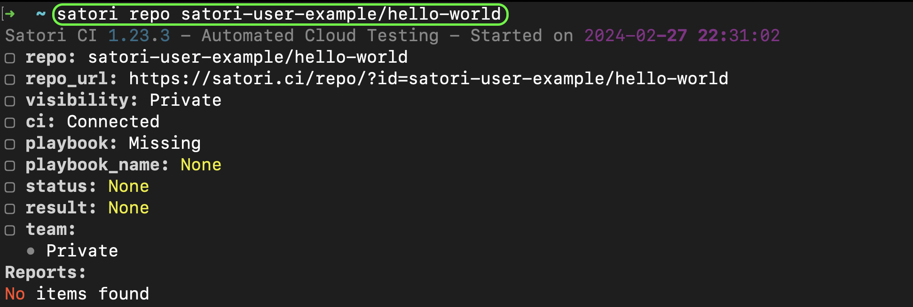

# Repositories

Satori provides automatic testing for repositories, in particular when they are connected to our [GitHub Application](https://github.com/apps/satorici). At the same time, we also have the possibility of testing repositories that are not connected to your CI, but that you have access to.

Whenever you want to check the status of your repositories, the Satori CLI repo command can assist you. It will execute the `.satori.yml` playbook within your repo unless you are using public playbooks (you can list them with `satori-cli playbook --public`)

## List

List all your repositories

```sh
$ satori repo
```


## Show

Shows if the repository is connected to CI, if it has a valid playbook and the last results of its execution (including any potential errors that could have been found during the execution of the playbook)

```sh
$ satori repo githubUsername/repository
```



## Run

### Playbook on a Repository

Run the .satori.yml playbook on the latest commit of the repository:

```sh
$ satori repo githubUsername/repository run
```


#### Private Playbook

If you want to run another playbook rather than looking for the `.satori.yml`, specify it with the `--playbook` parameter:

```sh
$ satori repo githubUsername/repository run --playbook playbook.yml
```

#### Public Playbook

Public playbooks can be listed with the command:

```sh
$ satori playbook --public
```

Public predefined tests by Satori are hosted on https://github.com/satorici/playbooks/, which is replaced by the short URI form `satori://`.

For example, you can run the public playbook satori://some/playbook.yml (equivalent to <https://github.com/satorici/playbooks/some/playbook.yml>):

```sh
$ satori repo githubUsername/repository run --playbook satori://some/playbook.yml
```


### Run on Multiple Repositories

Trufflehog is a piece of software that finds secrets stored in code. You can run the Trufflehog playbook to test all the repositories of a certain given account. For example:

```sh
$ satori repo "githubUsername/*" run --playbook satori://code/trufflehog.yml
```


### Analyze Commit

Run the repository's playbook on a specific commit (in whatever branch you want):

```sh
$ satori repo https://github.com/satorici/satori-cli/commit/96a654f9efb8962b20a514eccbe827518ca725b2 run
```


